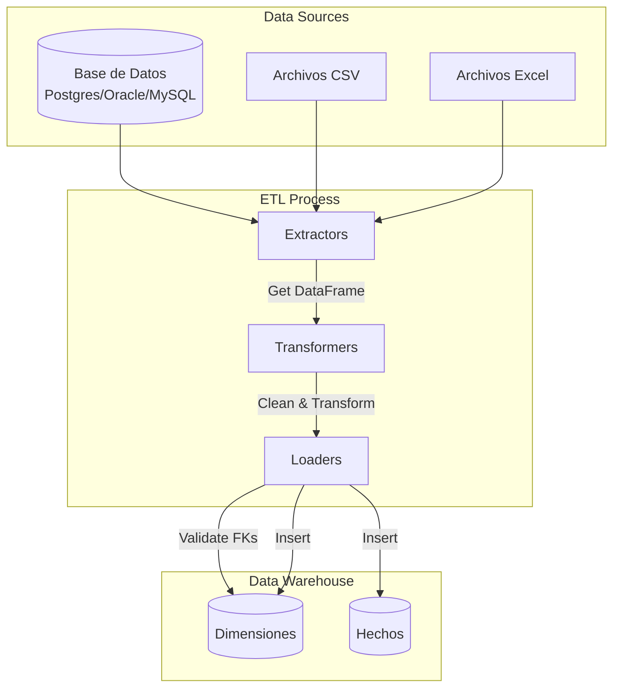
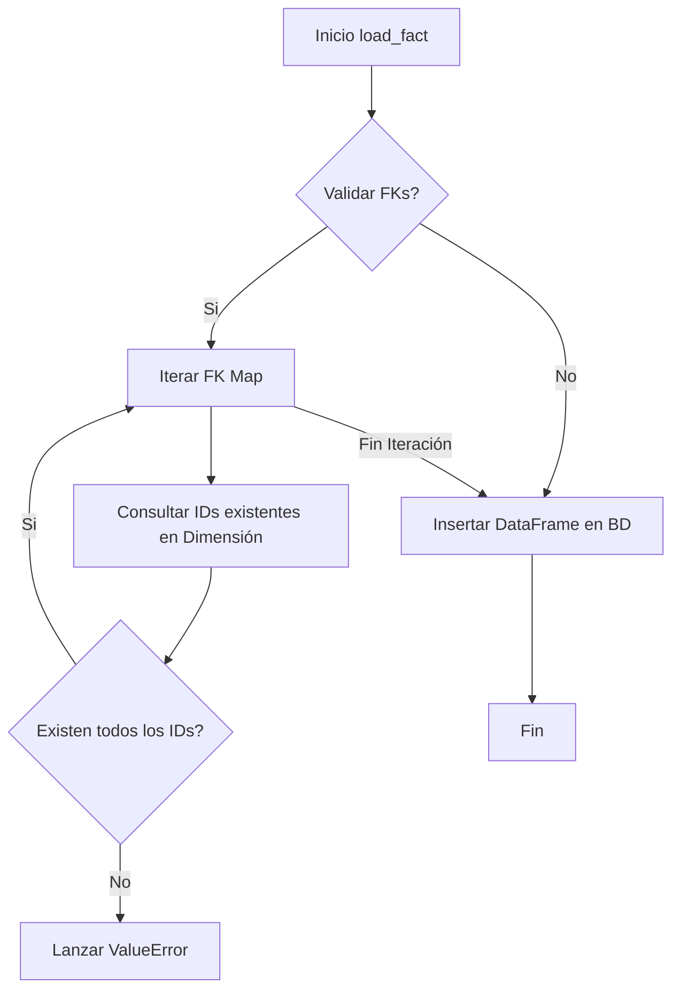
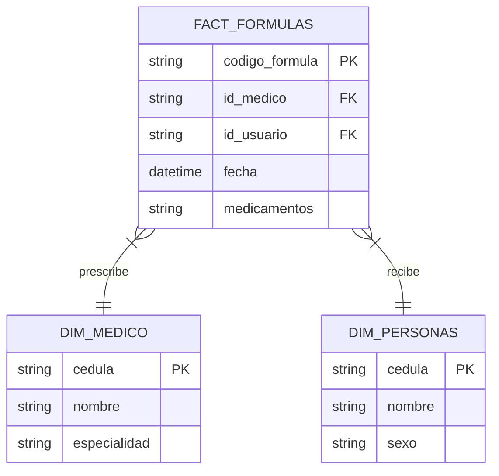

# Documentación Técnica del Proyecto ETL

## 1. Descripción General del Proyecto

### Propósito
Esta herramienta es una librería ETL (Extract, Transform, Load) desarrollada en Python, diseñada para simplificar y estandarizar la migración y procesamiento de datos entre diferentes fuentes (PostgreSQL, MySQL, Oracle, Archivos) y destinos. Actúa como un *wrapper* de alto nivel sobre **pandas** y **SQLAlchemy**, proporcionando abstracciones para tareas comunes de ingeniería de datos.

### Problema que Resuelve
Facilita la creación de pipelines de datos al abstraer la complejidad de:
- Conexiones a múltiples motores de base de datos.
- Transformaciones comunes de limpieza y formateo de datos.
- Validación de integridad referencial (claves foráneas) antes de la carga.
- Carga de modelos dimensionales (Tablas de Hechos y Dimensiones).

### Arquitectura
El proyecto sigue una **arquitectura modular orientada a capas** basada en el funcionamiento clásico de un ETL, donde cada etapa está desacoplada:
- **Extractors**: Recuperación de datos.
- **Transformers**: Lógica de negocio y limpieza.
- **Loaders**: Persistencia de datos.

### Flujo General
1. **Extract**: Se instancian extractores (`DB_Extractor`, etc.) para obtener DataFrames.
2. **Transform**: Se aplican métodos estáticos de las clases en `transformer/` (limpieza, joins, conversiones).
3. **Load**: Se utilizan loaders (`DB_Loader`) para insertar los datos transformados en el destino, validando reglas de negocio como claves foráneas.

### Dependencias Principales
Según `requirements.txt`:
- **pandas**: Motor principal de manipulación de datos en memoria.
- **sqlalchemy**: Abstracción de conexión a bases de datos.
- **numpy**: Operaciones numéricas.
- **holidays**, **python-dateutil**, **pytz**: Manejo de fechas.
- **tabulate**: Visualización de datos en consola.

---

## 2. Documentación por Archivo

### `etl/extractors/db_extractor.py`

#### Propósito
Gestionar las conexiones y la extracción de datos desde motores de base de datos relacionales.

#### Componentes Principales
- **Clase `DB_Extractor`**:
  - `__init__`: Configura credenciales y tipo de motor.
  - `connect()`: Establece la conexión SQLAlchemy.
  - `get_table()`: Extrae una tabla completa a DataFrame.
  - `execute_query()`: Ejecuta SQL raw.
  - `close_connection()`: Cierra recursos.

#### Flujo de Funcionamiento
El usuario configura los parámetros, llama a `connect`, y luego puede solicitar tablas o queries. El sistema maneja las diferencias en las cadenas de conexión para MySQL, PostgreSQL y Oracle.

#### Dependencias
- Externas: `sqlalchemy`, `pandas`.

### `etl/loaders/db_loader.py`

#### Propósito
Cargar DataFrames en bases de datos, especializándose en la carga de modelos dimensionales (Data Warehouses).

#### Componentes Principales
- **Clase `DB_Loader`**:
  - `load_dimension()`: Carga tablas de dimensión (generalmente modo `replace`).
  - `load_fact()`: Carga tablas de hechos con validación previa de integridad referencial.
  - `truncate_table()`: Limpieza de tablas.

#### Flujo de Funcionamiento
Recibe un `engine` de SQLAlchemy. Para las tablas de hechos, verifica primero si las Foreign Keys existen en las tablas de dimensiones correspondientes consultando la BD destino, evitando errores de integridad en tiempo de inserción.

#### Observaciones Técnicas
- Implementa validación manual de FKs para PostgreSQL, Oracle y MySQL antes de insertar.
- Trunca strings a 4000 caracteres para Oracle automáticamente.

### `etl/transformer/basics_data_transformer.py`

#### Propósito
Proveer validaciones y operaciones básicas. Contiene decoradores para asegurar que los inputs de las transformaciones sean correctos.

#### Componentes Principales
- **Decorador `validate_params`**: Asegura que el primer argumento sea un DataFrame, valida tipos de columnas y funciones lambda.

### `etl/transformer/advanced_data_transforms.py`

#### Propósito
Realizar transformaciones estructurales en los datos.

#### Componentes Principales
- **Clase `TransformOperations`**:
  - `left_join`: Cruce de tablas.
  - `group_by_mean`: Agregaciones.
  - `union_all`: Unión vertical de DataFrames.
  - `head`: Visualización previa.

### `etl/transformer/convert.py`

#### Propósito
Manejar la conversión de tipos de datos y limpieza de valores nulos o cadenas.

#### Componentes Principales
- **Clase `ConvertOperations`**:
  - `convert_column_type`: Casting de tipos (pandas, numpy, sql types).
  - `split_string_column`: Divide una columna de texto en múltiples columnas.
  - `fill_nulls`: Imputación de valores faltantes.

### `etl/transformer/selecs.py`

#### Propósito
Proporcionar métodos para la selección y filtrado de datos dentro de DataFrames.

#### Componentes Principales
- **Clase `DataSelect`**:
  - `select_columns`: Mantiene solo las columnas deseadas.
  - `unique_values`: Identifica valores únicos en una columna (útil para dimensionamiento).
  - `head`: Visualización tabular.

### `etl/transformer/header.py`

#### Propósito
Manipulación específica de los metadatos de las columnas (headers).

#### Componentes Principales
- **Clase `HeaderOperations`**:
  - `rename_columns`: Renombra columnas usando un diccionario de mapeo.
  - `head`: Visualización enfocada en headers.

### `etl/transformer/fecha.py`

#### Propósito
Generación de dimensiones de tiempo y manejo de fechas.

#### Componentes Principales
- **Clase `DateTime`**:
  - `__init__`: Recibe año de inicio y fin.
  - `_generate_date_dimension`: Crea un DataFrame con fechas en el rango, incluyendo atributos como año, mes, día.
  - **Holidays**: Incorpora festivos de Colombia usando la librería `holidays`.

---

## 3. Diagramas de Flujo

### Proceso ETL General

### Lógica de Carga de Hechos (`DB_Loader.load_fact`)

---

## 4. Modelo Dimensional

El framework facilita la implementación de modelos en **Esquema Estrella** o **Copo de Nieve**. Basado en los ejemplos de uso (`conexion.py` y `pagos__.py`), se infiere el soporte para los siguientes componentes:

### Estructura
- **Tablas de Dimensiones (`dim_`)**: Contienen atributos descriptivos. Se cargan típicamente con estrategia de reemplazo total (`replace`).
- **Tablas de Hechos (`fact_`)**: Contienen métricas y claves foráneas. Se cargan típicamente insertando nuevos registros (`append`).

### Ejemplo Inferido (Caso Salud)

### Métricas y Granularidad
- **Granularidad**: Depende de la transformación. En `pagos__.py`, se observa agregación (`group_by_mean`), lo que indica soporte para hechos agregados (ej. Costo promedio por estrato).
- **Métricas**: Valores numéricos como `valor_pagado`.

---

## 5. Arquitectura Técnica

### Patrones de Diseño
- **Facade / Wrapper**: Las clases en `transformer` y `extractors` envuelven librerías complejas (`pandas`, `sqlalchemy`) para ofrecer una API simplificada.
- **Strategy**: (Implícito) Los extractores y loaders manejan diferentes estrategias de conexión según el `db_type`.

### Manejo de Errores
- Uso extensivo de bloques `try-except` en métodos principales.
- Validación defensiva de parámetros mediante decoradores (`validate_params`).
- Validación de integridad de datos (FKs) antes de persistir.

### Estrategia de Base de Datos
- Uso de `SQLAlchemy` como ORM/Query Builder agnóstico.
- Soporte explícito para dialectos de PostgreSQL, MySQL y Oracle.

---

## 6. Flujo de Ejecución

La herramienta se ejecuta importando los módulos en scripts de Python orquestadores.

**Ejemplo de Secuencia (`pagos__.py`):**

1. **Configuración**: Definición de diccionarios con credenciales de BD.
2. **Conexión Source**: Instanciación de `DB_Extractor` y llamada a `.connect()`.
3. **Extracción**: Llamada a `.get_table()` para obtener DataFrames en memoria.
4. **Transformación**: Uso de `TransformOperations` y `DataSelect` para joins y limpieza.
5. **Carga**: Instanciación de `DB_Loader` con la conexión destino.
   - Carga de dimensiones (`load_dimension`).
   - Carga de hechos (`load_fact`).
6. **Cierre**: Cierre explícito de conexiones en bloque `finally`.

---

## 7. Consideraciones Técnicas y Riesgos

### Seguridad
- ⚠️ **Credenciales Hardcodeadas**: Los scripts de ejemplo (`conexion.py`, `pagos__.py`) contienen contraseñas en texto plano. Se recomienda encarecidamente usar variables de entorno (`os.environ`) o un gestor de secretos.

### Rendimiento
- **Procesamiento en Memoria**: Al basarse en `pandas`, todo el dataset debe caber en la memoria RAM de la máquina que ejecuta el proceso. Para volúmenes masivos de datos (Big Data), esta arquitectura podría no escalar (considerar Spark o Dask).
- **Validación FK Iterativa**: La validación de claves foráneas realiza consultas `SELECT` con cláusulas `IN` o `ANY`. Si la dimensión es muy grande o hay muchas claves únicas en el hecho, esto podría ser lento.

### Calidad de Datos
- El sistema tiene una fortaleza en la validación preventiva de integridad referencial, reduciendo fallos a nivel de base de datos interrumpiendo el proceso antes de la inserción inválida.

### Mejoras Sugeridas
- Implementar manejo de transacciones con `rollback` en caso de fallo parcial en una carga múltiple.
- Añadir logging estructurado en lugar de `print` para entornos productivos.

---

## 8. Resumen Ejecutivo

| Característica | Evaluación |
|:---|:---|
| **Nivel de Madurez** | Medio. Funcional para cargas medias y proyectos departamentales. |
| **Complejidad** | Baja. La abstracción simplifica mucho el uso de Pandas/SQL. |
| **Riesgo Principal** | Escalabilidad de memoria (RAM) y gestión de credenciales. |
| **Recomendación** | Ideal para datamarts pequeños/medianos o migraciones puntuales. Para producción, externalizar configuración y mejorar el logging. |
